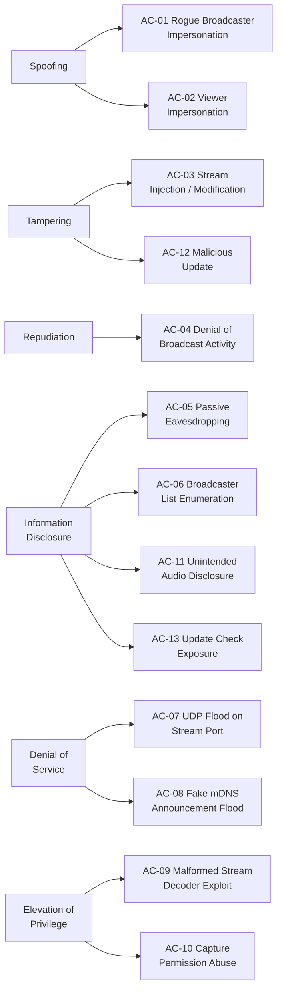
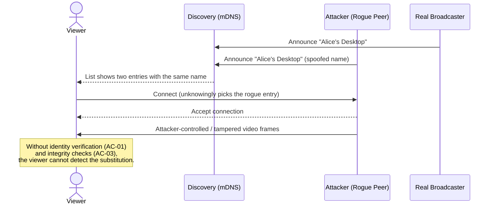

# Abuse Cases (STRIDE)

This document analyzes threats against Peeroxide using the **STRIDE** framework: Spoofing, Tampering, Repudiation, Information Disclosure, Denial of Service, and Elevation of Privilege. Because the application has no central server, most threats originate from other peers or devices on the same LAN.

## Threat Catalog

| ID | STRIDE | Abuse Case | Description | Affected Asset / Requirement | Suggested Mitigation |
|----|--------|------------|--------------|-------------------------------|------------------------|
| AC-01 | Spoofing | Rogue Broadcaster Impersonation | An attacker on the LAN announces a fake broadcaster via mDNS using a legitimate-looking name (or the same name as a real peer), tricking viewers into connecting to it and watching attacker-controlled content instead of the intended one. | FR-05 (Broadcaster Listing), FR-06 (Single-Stream Viewing) | Show a stable per-peer identity (e.g., a fingerprint derived from a long-lived key pair) alongside the display name; warn the user when a name reappears with a different fingerprint (TOFU trust model). |
| AC-02 | Spoofing | Viewer Impersonation | An attacker impersonates an authorized viewer's network identity to receive a stream not intended for them, relevant if access control is added later (e.g., "only these peers may view"). | FR-09 (Concurrent Viewers per Broadcaster) | Per-connection authentication (signed connection request) instead of trusting source IP alone. |
| AC-03 | Tampering | Stream Injection / Modification | Video travels as UDP packets; an on-path attacker (e.g., via ARP spoofing on the LAN) can intercept and modify encoded frames in transit, causing corrupted or misleading content to be rendered on the viewer's screen. | FR-10 (Stream Rendering), NFR-10 (Transport Confidentiality) | Authenticate and integrity-protect the wire format (e.g., AEAD cipher such as ChaCha20-Poly1305) so tampered packets are detected and dropped. |
| AC-04 | Repudiation | Denial of Broadcast Activity | With no logging, a user who broadcasts inappropriate or unauthorized content on a shared network can deny having done so, and there is no way to attribute a given stream to a specific peer after the fact. | Accountability / incident response | Keep local session logs (start/stop timestamps, peer identity) on both broadcaster and viewer sides; do not require a central server for this. |
| AC-05 | Information Disclosure | Passive Eavesdropping | Any device with access to the LAN (a compromised host, a poorly isolated Wi-Fi network) can passively capture unencrypted UDP traffic and reconstruct a broadcaster's video stream, exposing on-screen content to unintended parties. | NFR-10 (Transport Confidentiality) | Encrypt the video/control channel end-to-end (e.g., a Noise protocol handshake establishing a session key, then a symmetric stream cipher for frames). |
| AC-06 | Information Disclosure | Broadcaster List Enumeration | A passive listener can enumerate all active broadcasters via mDNS traffic alone, learning who on the network is currently sharing their screen — itself a disclosure of presence/activity, even without watching any content. | FR-01 (Peer Discovery) | Allow a "discoverable" toggle so a peer can broadcast without announcing itself network-wide, accepting only connections from explicitly known peers. |
| AC-07 | Denial of Service | UDP Flood on Stream Port | An attacker floods the UDP port used for video streaming (broadcaster or viewer side) with garbage packets, exhausting bandwidth or CPU and disrupting legitimate streaming. | NFR-01 (Latency), NFR-04 (Packet Loss Tolerance) | Validate and cheaply discard malformed packets before attempting any decode; apply per-source rate limiting. For audio: check every audio packet's declared length against a small fixed limit before allocating, and cap the number of streams a peer may open on a connection. |
| AC-08 | Denial of Service | Fake mDNS Announcement Flood | An attacker floods the network with a large number of fake broadcaster announcements, overwhelming the viewer's peer list UI and potentially causing resource exhaustion if the app probes/connects to each one. | FR-05 (Broadcaster Listing), NFR-09 (Responsive UI) | Cap the number of tracked peers, deduplicate/validate announcements, and back off on sources that repeatedly send invalid entries. |
| AC-09 | Elevation of Privilege | Malformed Stream Decoder Exploit | An attacker who is or has hijacked a broadcaster role sends a deliberately malformed encoded video or audio stream crafted to exploit a memory-safety bug in the decoder (e.g., a native H.264/H.265 or Opus decoding library), aiming for remote code execution on the viewer's machine. | FR-10 (Stream Rendering), FR-14 (Audio Sharing) | Prefer well-audited/memory-safe decoder bindings, isolate the decode step (separate process or sandbox), keep decoding libraries patched, and fuzz-test the decode path. For audio, use a pure-Rust Opus decoder (no C code; its few `unsafe` blocks are bounds-check elision and SIMD) on its own thread with panics caught, so a malformed packet can at worst silence the audio, never the video. |
| AC-10 | Elevation of Privilege | Capture Permission Abuse | On platforms that require explicit screen-recording permission (notably macOS), a compromised or maliciously modified build of the app could capture more than the user selected (e.g., the whole desktop when only a window was chosen, or all system sound when only one application's window was shared) if source selection is not strictly enforced at the OS API boundary. | FR-03 (Capture Source Selection), FR-14 (Audio Sharing) | Strictly enforce the user-selected capture source through the OS capture API itself (not by post-cropping a full-desktop capture, or filtering a full system-sound capture), and clearly surface what is being captured in the UI at all times. For a shared window, capture only that application's audio through the OS per-process audio capture API; never capture the microphone. |
| AC-11 | Information Disclosure | Unintended Audio Disclosure | Sharing a full desktop's sound also sends whatever else plays on the computer: the other side of a voice or video call, notification sounds, media in another app. A broadcaster who only meant to share a game or a video can leak private conversations to every viewer on the network. | FR-14 (Audio Sharing), FR-15 (Broadcast Without Audio) | Make audio opt-in (off by default) and chosen explicitly before each broadcast; state exactly what will be captured for the selected source ("only this app" vs. "all sound except Peeroxide"); prefer sharing a single window, whose audio is limited to that application; never capture the microphone; capture nothing while no one is watching; exclude Peeroxide's own playback so a peer that is also watching never re-broadcasts another stream. Viewer access controls (roadmap 0.6, AC-02) apply to audio as well. |
| AC-12 | Tampering / Elevation of Privilege | Malicious Update | The app installs new versions of itself automatically, so whoever can make it accept a fake update runs code on every tester's computer. Routes: a hijacked GitHub account or replaced release file, a man-in-the-middle on the download (e.g. a hostile Wi-Fi network, or HTTPS interception), a genuine but *older* signed package passed off as the new one (replay/downgrade), or a crafted archive that writes outside the app folder. | FR-17 (Automatic Updates), NFR-15 (Update Authenticity) | Sign every release package with a minisign (Ed25519) key that never leaves the maintainer's machine; ship the public key inside the app and refuse anything without a valid signature, so even a compromised GitHub account can't push code. Make the signed comment name the exact package file, and only accept strictly newer versions, which blocks replays and downgrades. Download over HTTPS with certificate validation; cap response and download sizes; verify before extracting anything; extract only the one expected executable, never paths outside the folder. Log every update and failed verification (AC-04). |
| AC-13 | Information Disclosure | Update Check Exposure | Each start contacts GitHub, which learns the user's IP address, that they run Peeroxide, and its version (User-Agent). On a VPN like Radmin this is the user's real internet address, not the VPN one. | FR-17 (Automatic Updates) | Send nothing else (no identity, name, peers or settings); one request per start; allow turning it off with `--no-update`. Document the check in the README. |

## Representative Attack Scenario (AC-01 + AC-03)

The sequence below illustrates a rogue peer that both impersonates a legitimate broadcaster and tampers with the stream — showing why spoofing and tampering mitigations are complementary.

