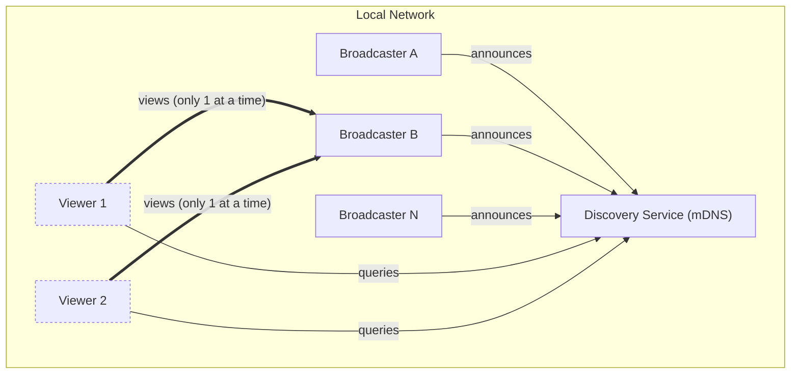

# Functional Requirements

This document lists the functional requirements (FR) for Peeroxide: a cross-platform (Windows/macOS/Linux) Rust application that lets multiple peers on the same local network broadcast their screen simultaneously, while each viewer watches only one broadcaster's stream at a time. No central server is involved; peers discover and connect to each other directly.

Audio is optional: a broadcaster may share the audio of the captured source alongside the video (FR-14 to FR-16).

## System Context

Each broadcaster streams independently to whichever viewers are currently connected to it. A viewer holds at most one active viewing connection at any given time.

## Requirements

| ID | Requirement | Description | Priority |
|----|-------------|-------------|----------|
| FR-01 | Peer Discovery | The application shall automatically discover other instances of the application running on the same LAN segment, without requiring the user to manually enter an IP address. | High |
| FR-02 | Start Broadcast | A user shall be able to start broadcasting their screen to the network. | High |
| FR-03 | Capture Source Selection | A broadcaster shall be able to choose whether to share the full desktop or a single application window as the video source. | Medium |
| FR-04 | Stop Broadcast | A broadcaster shall be able to stop broadcasting at any time, immediately terminating all active viewer sessions for that stream. | High |
| FR-05 | Broadcaster Listing | A viewer shall see an up-to-date list of all broadcasters currently active on the LAN. | High |
| FR-06 | Single-Stream Viewing | A viewer shall be able to view the video of only one broadcaster at a time. | High |
| FR-07 | Switch Broadcaster | A viewer shall be able to switch from the currently viewed broadcaster to a different one; switching closes the previous stream connection before opening the new one. | High |
| FR-08 | Concurrent Broadcasters | The network shall support multiple broadcasters transmitting independently and simultaneously, with no central coordinator. | High |
| FR-09 | Concurrent Viewers per Broadcaster | A single broadcaster shall be able to serve multiple viewers concurrently. | Medium |
| FR-10 | Stream Rendering | The viewer application shall decode and render the received video stream in the GUI in near real time. | High |
| FR-11 | Connection Status Feedback | The application shall display the current connection state for each stream (e.g., Connecting, Streaming, Disconnected, Error). | Medium |
| FR-12 | Broadcaster Disconnect Handling | If a broadcaster stops sharing or becomes unreachable, all of its viewers shall be notified and returned to the broadcaster list. | High |
| FR-13 | Cross-Platform Interoperability | A broadcaster running on one supported OS shall be viewable by a viewer running on any other supported OS (Windows, macOS, Linux). | High |
| FR-14 | Audio Sharing | A broadcaster shall be able to share the audio of the captured source alongside the video: only the shared application's sound for a window, or the computer's sound output (excluding Peeroxide's own playback) for a full desktop. The microphone is never captured. Viewers hear the audio in sync with the video. | Medium |
| FR-15 | Broadcast Without Audio | Sharing audio shall be optional and off by default. The broadcaster chooses before starting a broadcast, the choice is remembered, and viewers are told when a broadcast has no audio. | Medium |
| FR-16 | Viewer Volume Control | A viewer shall be able to change the playback volume of the stream (0–100%) and mute it. The setting only affects that viewer and is remembered across sessions. | Medium |

## Traceability Notes

- FR-06 and FR-07 are the core simplification constraint of this app: the UI and network layer never need to composite or decode more than one incoming stream at a time on the viewer side.
- FR-08 and FR-09 mean the architecture must treat "broadcaster" and "viewer" as roles a peer can hold independently and simultaneously (a peer could, in principle, broadcast and view at the same time).
- FR-14 to FR-16: audio is an optional companion to the video, never a dependency. A broadcast or a viewing session must keep working video-only when audio is off, unsupported, or failing (see NFR-05).
