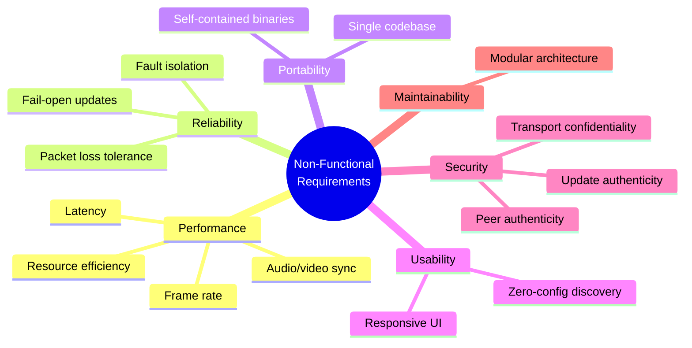

# Non-Functional Requirements

This document lists the non-functional requirements (NFR) for Peeroxide, grouped by quality attribute.

## Performance

| ID | Requirement | Description |
|----|-------------|-------------|
| NFR-01 | Latency | End-to-end (capture-to-display) latency should stay under approximately 150 ms on a typical wired/Wi-Fi LAN. This applies to audio (capture-to-playback) as well as video. |
| NFR-02 | Frame Rate | The system should sustain at least 30 FPS at 1080p on typical consumer hardware from the last ~5 years. |
| NFR-03 | Resource Efficiency | The application should use hardware-accelerated encode/decode (e.g., NVENC, Quick Sync, VideoToolbox, VAAPI) when available, to minimize CPU load during capture, encoding, and decoding. |
| NFR-13 | Audio/Video Synchronization | When audio is shared, it should play within about 45 ms before to 125 ms after the matching video (the detectability thresholds of ITU-R BT.1359). Sync is achieved by delaying audio, never by delaying video. |

## Reliability

| ID | Requirement | Description |
|----|-------------|-------------|
| NFR-04 | Packet Loss Tolerance | The video pipeline should degrade gracefully (minor visual artifacts, momentary freeze) rather than crash or hang when UDP packet loss occurs. |
| NFR-05 | Fault Isolation | A failure or crash in one broadcaster/viewer session should not affect other unrelated sessions running on the same peer. |
| NFR-14 | Fail-Open Updates | Checking for and installing updates must never keep the user from the installed version: when offline or on any error, startup continues within about 5 seconds, and a failed update leaves the current version intact and working. |

## Portability

| ID | Requirement | Description |
|----|-------------|-------------|
| NFR-06 | Cross-Platform Codebase | The application shall be built from a single Rust codebase that compiles and runs natively on Windows (10 and 11), macOS, and Linux (both X11 and Wayland sessions). |
| NFR-07 | Minimal Runtime Dependencies | The application should be distributable as a self-contained binary per platform, avoiding mandatory external runtime installs (e.g., no separately installed system-wide FFmpeg requirement). |

## Usability

| ID | Requirement | Description |
|----|-------------|-------------|
| NFR-08 | Zero-Configuration Discovery | Users should be able to find and connect to peers without manually entering IP addresses or ports. |
| NFR-09 | Responsive UI | The GUI shall remain responsive (non-blocking) while capturing, encoding, decoding, streaming, or discovering peers. |

## Security

| ID | Requirement | Description |
|----|-------------|-------------|
| NFR-10 | Transport Confidentiality | Video and control traffic should be protected against passive eavesdropping by other devices on the LAN (see `abuse-cases.md`, Information Disclosure). |
| NFR-11 | Peer Authenticity | The system should provide a way for a viewer to verify that a broadcaster's advertised identity has not been spoofed (see `abuse-cases.md`, Spoofing). |
| NFR-15 | Update Authenticity | The application shall only install updates that carry a valid signature from the project's release key (kept offline, never in the repository or on GitHub) and that are strictly newer than the running version (see `abuse-cases.md`, AC-12). |

## Maintainability

| ID | Requirement | Description |
|----|-------------|-------------|
| NFR-12 | Modular Architecture | Capture, encoding, networking, discovery, and GUI concerns shall be separated into independent modules/crates to ease independent testing and evolution (e.g., swapping the GUI framework or codec later without touching networking code). |
