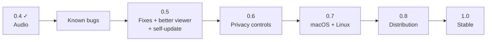

# Roadmap

Where Peeroxide stands after **0.5.0 (pre-alpha)**, and what comes next. Audio, first planned as 0.6, shipped in 0.4.0, so the fixes and privacy milestones each moved up one number. Requirement IDs (FR-, NFR-, AC-) refer to [functional-requirements.md](functional-requirements.md), [non-functional-requirements.md](non-functional-requirements.md) and [abuse-cases.md](abuse-cases.md).

## Known bugs

Fix these first; most are small.

| ID | Bug | Cause | Proposed fix |
|----|-----|-------|--------------|
| BUG-01 | **CI fails on all three platforms** (Windows, macOS, Linux). | GitHub's runners use a newer stable Rust than the project was developed with (1.97). Its clippy flags `chunks_exact_mut` with a constant chunk size in `crates/capture`, and CI treats warnings as errors. | Fix the lint (`as_chunks_mut`), and pin the toolchain with a `rust-toolchain.toml` so local and CI builds agree. What breaks on macOS/Linux after this step is still unknown. |
| BUG-02 | **The fps counter drops (e.g. to ~15 and falling) while the stream still looks smooth.** Reported in real use. | Windows only delivers a new frame when the screen changes, so a still screen legitimately produces fewer frames. The overlay counts frames received and can't tell "nothing changed" from "frames were lost". | Tell the two apart. The broadcaster knows when it skips because nothing changed, so it could signal "idle" (or count only active periods), and the overlay would show e.g. `30 fps` / `idle (screen unchanged)` instead of a falling number. |
| BUG-03 | The source list includes invisible system windows (e.g. "Windows Input Experience"). | Window enumeration doesn't filter *cloaked* windows. | Skip windows reported as cloaked by DWM. |
| BUG-04 | After a broadcaster **crashes**, it can stay in viewers' lists; clicking it fails with "Could not reach". | A crash sends no mDNS goodbye, so the entry waits for its records to expire. | Shorter record TTLs, and mark or remove a peer after a failed connection attempt. |
| BUG-05 | Wasted CPU while broadcasting a busy monitor. | On Windows builds without the capture rate-limit API (e.g. 23H2), every frame the OS delivers is copied (82 fps measured) even though only 30 are encoded. | Skip copying frames that arrive faster than the preset frame rate. |
| BUG-06 | The "capture → decode" latency line is meaningless between two computers. | It compares two different clocks. It is labelled "same machine only", but it is still shown. | Only show it when both ends are on the same machine, or measure round-trip time instead. |
| BUG-07 | Viewers of a minimized window see a frozen picture with no explanation. | Windows stops delivering frames for minimized windows; the last frame stays on screen. | Tell viewers the shared window is minimized. |
| BUG-08 | A shared window includes its title bar and frame. | Windows Graphics Capture captures the whole window. | Offer "content only" (crop the title bar, which `windows-capture` can do). |
| BUG-09 | Upgrading from 0.2 while the old version is still open leaves the old data folder behind. | The folder can't be moved while its log file is open, so it is copied instead. | Delete the old folder on a later start once nothing holds it. |

### Built but not yet verified by hand

These pass automated tests, but nobody has clicked through them yet:
- Clicking a contact under **Saved** to reconnect.
- Switching broadcasters by clicking in the list.
- Renaming yourself with ✏ and restarting.
- The 🗑 (forget contact) icon rendering correctly.
- The 0.2 → 0.3 data-folder migration on a real installation.
- A long session over Radmin VPN with the **Internet / VPN** preset while scrolling or playing video.
- Self-update (built for 0.5): Skip; a read-only folder showing the download link; two profiles starting at once; and a real update through GitHub, which needs a release after the first one that contains the updater. Checked on one PC with a throwaway key and a local server: installing, restarting with "Updated to …", no update loop, a tampered package rejected, and opening quickly with no server.
- Audio on Windows 10 (only tested on Windows 11). Per-app capture is expected to work from 2004 (build 19041); Microsoft only documents it from build 20348.
- Audio, item by item: the test tone matching the flashing square; volume and mute; sharing a browser window (only its sound); sharing a monitor while also watching someone (no feedback); a session over Radmin VPN. Checked so far: audio between two PCs on a LAN (by hand, before the 0.4.0 release), the whole pipeline on one machine (A/V offset about +55–64 ms, no underruns), the "not sharing audio" notice, and system loopback capture.

## 0.4 — Audio (FR-14 to FR-16) · released

Goal: hear what the broadcaster hears. Released as 0.4.0, ahead of the fixes and privacy work first planned before it. Tested between PCs on a LAN; the remaining checks are listed under "Built but not yet verified by hand".

- ✅ **Desktop audio** on Windows through process loopback, excluding Peeroxide's own playback, so a peer that broadcasts and watches at once never feeds a stream back.
- ✅ **Audio of just the shared window**: the window's process tree only (Windows 10 2004+).
- ✅ Opus via the pure-Rust `opus-rs` (no CMake, no C). Sent on its own QUIC stream ahead of video. Kept in sync by delaying audio to match the video, using the capture timestamps both streams carry.
- ✅ Viewer: volume and mute, remembered. Broadcaster: "Share audio", off by default, chosen before starting, and stating exactly what it captures.
- ✅ Protocol version 2. 0.3 peers get "incompatible version".
- Known gaps:
  - Windows Store (UWP) windows share no sound: their window belongs to `ApplicationFrameHost.exe`, not the app. Detect that and say so, or look up the app's real process.
  - No mute while live. The user chose to fix the choice for a broadcast; revisit if needed (AC-11).
  - Audio plays about 60 ms after the video when the video path is very fast (test pattern). That is within NFR-13, but could shrink with 10 ms Opus frames or an adaptive jitter margin.
  - Audio packets travel on a reliable stream. Over lossy internet links, QUIC datagrams with Opus loss concealment would avoid retransmission stalls.

## 0.5 — Fixes and a better viewer

Goal: a solid Windows build that is pleasant to watch, and that keeps itself up to date.

**0.5.0 released** with the self-update, the Windows app details, fullscreen, and much lower CPU use when sharing a window (see Performance in the README). Everyone installs it by hand once. The rest of this milestone follows in later 0.5 releases, which arrive through the updater.

- **Self-update on start (FR-17, UC-09) · built.** Like Discord or Steam: the app checks GitHub Releases, downloads a newer version with progress and Skip, verifies its minisign signature against the key built into the app (AC-12, NFR-15), replaces itself and restarts. It fails open (NFR-14). Brought forward from 0.8, where it was only planned as a notification. The release key exists (ID `1FAB31191B660C70`, public key in `crates/update/release-key.pub`; see [releasing.md](releasing.md)). Everyone installs 0.5.0 by hand once; later versions arrive by themselves.
- **The exe looks like a real Windows app · built.** The Peeroxide icon (pixel-art pier) in Explorer, the taskbar and the window; version details in Properties and Task Manager ("Peeroxide", © Peeroxide contributors). Plus the "Unblock" tip for the SmartScreen warning in the quickstart, README and release notes.
- All known bugs above fixed, and CI green on Windows.
- **Fullscreen viewer · built.** F11, a double-click on the video or the Fullscreen button toggle it, and Esc leaves. A bar with the name, mute, volume and exit appears when the mouse moves and hides with the cursor. It ends by itself when the stream does (FR-18, UC-10).
- **Zoom**: fit to window (current behaviour), 100% (pixel-exact, scrollable), and fill.
- **Pop-out window**: watch the stream in its own window while the controls stay in the main one.
- **Toggle the stats overlay**, off by default for normal users.
- Show the broadcaster's name and ID on the video while watching.

## 0.6 — Privacy controls (AC-02)

Goal: the broadcaster decides who watches. Today anyone who can reach you on the network can watch while you broadcast.

- **See who is watching**: names and IDs of connected viewers, live, in the broadcast panel.
- **Kick** a viewer.
- **Approve / deny** new viewers with a prompt ("Bob (FD7C-A21D) wants to watch"), with "always allow" remembered per ID.
- **Optional password** for a broadcast.
- Viewers authenticate with their own identity (mutual TLS using the certificate every peer already has), so the ID the broadcaster sees can't be faked.
- Protocol change: viewers wait for approval before video starts. Bump the protocol version (to 3; audio already took 2) and keep the "incompatible version" message clear.
- The approval and access controls cover audio too: today anyone who can watch a broadcast also hears it (AC-11).

## 0.7 — macOS and Linux

Goal: the same features on all three platforms, tested on real machines. Targets: Windows 10 and 11, macOS, and Linux on both X11 and Wayland.

- CI green on macOS and Linux (after BUG-01).
- **macOS**: run the ScreenCaptureKit path; handle the Screen Recording permission flow (prompt, restart hint); package as an `.app` so the permission belongs to the app, not the terminal.
- **Linux**: run the PipeWire / xdg-desktop-portal path on Wayland (GNOME and KDE), and support X11 too (decided: both are targets). `scap` 0.0.8 only captures through the portal, so X11 needs its own capture path or a different library.
  - Known risk: the `scap` 0.0.8 Linux backend asks PipeWire for RGBA but panics if it actually receives it. Patch or replace it before calling Linux supported.
- Cross-platform interoperability (FR-13): Windows ↔ macOS ↔ Linux sessions verified.
- **Audio capture** (0.4 capture is Windows-only; playback and everything else already builds for all three):
  - **macOS**: ScreenCaptureKit audio through the `screencapturekit` crate `scap` already pulls in. It has `captures_audio` and `excludes_current_process_audio`, and returns PCM buffers. Needs macOS 13+; macOS 12.3–12.x keeps video only, with a note. Uses the same Screen Recording permission. To verify on a real Mac: a window share gets only that window's app's sound.
  - **Linux**: audio is the same on X11 and Wayland; it depends on the sound server. Decide between:
    - PipeWire natively: already a dependency. Per-app capture and "everything except Peeroxide" by linking app streams. Doesn't reach systems where PulseAudio plays the sound (e.g. Ubuntu 22.04 LTS).
    - PulseAudio's API: works on PulseAudio and on PipeWire (through pipewire-pulse). Needs `libpulse-dev` to build. Excluding Peeroxide's own playback is harder, so broadcasting while watching could feed a stream back.
  - **Linux window shares**: on Wayland the portal doesn't say which window was picked, so the window's app can't be found. Share all sound except Peeroxide, labelled as such, or add a "which app's sound?" picker.
  - Needs real machines: none of this can be tested from the Windows development PC. CI (after BUG-01) covers compiling and unit tests only.

## 0.8 — Distribution

Goal: installing and updating is easy and trustworthy.

- **Release builds in CI**: a GitHub Actions workflow builds, zips and attaches the binaries to a GitHub release when a tag is pushed. It also enables NASM, so OpenH264 uses its optimized assembly, which local builds without NASM don't.
- **Installer** for Windows (MSI or a setup `.exe`) with Start-menu shortcut and uninstall. Packages for macOS (`.dmg`) and Linux (AppImage or Flatpak) once 0.7 lands.
- **Updates**: the Windows self-update shipped early (see 0.5). Here: update packages for macOS (`.app`) and Linux, and signing releases in CI with the key stored as a secret, if CI builds the releases.
- **Code signing** so Windows stops showing the SmartScreen warning. Until then, the "Unblock" tip and the self-update keep it to one warning per tester. Options, as of 2026-09:
  - **Azure Artifact Signing** (Microsoft, ~US$10/month): only for individuals in the US or Canada, so not available to this project as it stands.
  - **Certum Open Source Code Signing** (~US$50–70/year): open to individual open-source developers, with identity checked by documents. The key lives in their cloud (SimplySign) and signing uses `signtool`, which fits `just package`. Certificates now last at most 459 days.
  - **SignPath Foundation** (free for open source): needs releases built by CI (GitHub Actions, after BUG-01) and approved per release. The publisher shows as "SignPath Foundation", and the project must credit SignPath and publish a code-signing policy.
  - Since 2024, no certificate (OV or EV) gives instant SmartScreen trust. Signed apps still build reputation as people download and run them, so early warnings may continue for a while.
  - macOS needs Apple notarization.
- **H.264 licensing**: ship Cisco's prebuilt OpenH264 library, which the `openh264` crate can load and which is covered by Cisco's patent license, instead of compiling it from source.

## 1.0 — Stable

Goal: something you can hand to anyone.

- Everything above done and verified on Windows, macOS and Linux.
- **Security hardening (AC-09)**: fuzz the protocol parsers and the decoder input path; run video decoding in a separate, restricted process.
- A compatibility policy: from 1.0 on, newer versions still talk to older 1.x versions.
- Manual test checklist run on real machines for each release.

## Later / ideas

Not scheduled; to be picked up when they become important.

- **Hardware encoding** (NFR-03): NVENC / AMD AMF / Quick Sync / VideoToolbox behind the existing `VideoEncoder` trait. Lower CPU use, higher resolutions and frame rates.
- IPv6 support.
- 1440p / 60 fps presets (realistic with hardware encoding).
- Viewer-side recording of a stream.
- Pointer highlighting or drawing on the shared screen.
- Discovery across subnets and VPNs that block multicast, e.g. by sharing saved contacts.
