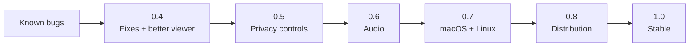

# Roadmap

Where Peeroxide stands after **0.3.0 (pre-alpha)**, and what comes next. Requirement IDs (FR-, NFR-, AC-) refer to [functional-requirements.md](functional-requirements.md), [non-functional-requirements.md](non-functional-requirements.md) and [abuse-cases.md](abuse-cases.md).

## Known bugs

Fix these first; most are small.

| ID | Bug | Cause | Proposed fix |
|----|-----|-------|--------------|
| BUG-01 | **CI fails on all three platforms** (Windows, macOS, Linux). | GitHub's runners use a newer stable Rust than the project was developed with (1.97). Its clippy flags `chunks_exact_mut` with a constant chunk size in `crates/capture`, and CI treats warnings as errors. | Fix the lint (`as_chunks_mut`), and pin the toolchain with a `rust-toolchain.toml` so local and CI builds agree. What breaks on macOS/Linux after this step is still unknown. |
| BUG-02 | **The fps counter drops (e.g. to ~15 and falling) while the stream still looks smooth.** Reported in real use. | Windows only delivers a new frame when the screen changes, so a still screen legitimately produces fewer frames. The overlay counts frames received and can't tell "nothing changed" from "frames were lost". | Tell the two apart. The broadcaster knows when it skips because nothing changed, so it could signal "idle" (or count only active periods), and the overlay would show e.g. `30 fps` / `idle (screen unchanged)` instead of a falling number. |
| BUG-03 | The source list includes invisible system windows (e.g. "Windows Input Experience"). | Window enumeration doesn't filter *cloaked* windows. | Skip windows reported as cloaked by DWM. |
| BUG-04 | After a broadcaster **crashes**, it can stay in viewers' lists; clicking it fails with "Could not reach". | A crash sends no mDNS goodbye, so the entry waits for its records to expire. | Shorter record TTLs, and mark or remove a peer after a failed connection attempt. |
| BUG-05 | Wasted CPU while broadcasting a busy monitor. | On Windows builds without the capture rate-limit API (e.g. 23H2), every frame the OS delivers is copied (82 fps measured) even though only 30 are encoded. | Skip copying frames that arrive faster than the preset frame rate. |
| BUG-06 | The "capture → decode" latency line is meaningless between two computers. | It compares two different clocks. It is labelled "same machine only", but it is still shown. | Only show it when both ends are on the same machine, or measure round-trip time instead. |
| BUG-07 | Viewers of a minimized window see a frozen picture with no explanation. | Windows stops delivering frames for minimized windows; the last frame stays on screen. | Tell viewers the shared window is minimized. |
| BUG-08 | A shared window includes its title bar and frame. | Windows Graphics Capture captures the whole window. | Offer "content only" (crop the title bar, which `windows-capture` can do). |
| BUG-09 | Upgrading from 0.2 while the old version is still open leaves the old data folder behind. | The folder can't be moved while its log file is open, so it is copied instead. | Delete the old folder on a later start once nothing holds it. |

### Built but not yet verified by hand

These pass automated tests, but nobody has clicked through them yet:
- Clicking a contact under **Saved** to reconnect.
- Switching broadcasters by clicking in the list.
- Renaming yourself with ✏ and restarting.
- The 🗑 (forget contact) icon rendering correctly.
- The 0.2 → 0.3 data-folder migration on a real installation.
- A long session over Radmin VPN with the **Internet / VPN** preset while scrolling or playing video.

## 0.4 — Fixes and a better viewer

Goal: a solid Windows build that is pleasant to watch.

- All known bugs above fixed, and CI green on Windows.
- **Fullscreen viewer**: double-click or F11 to toggle, Esc to leave.
- **Zoom**: fit to window (current behaviour), 100% (pixel-exact, scrollable), and fill.
- **Pop-out window**: watch the stream in its own window while the controls stay in the main one.
- **Toggle the stats overlay**, off by default for normal users.
- Show the broadcaster's name and ID on the video while watching.

## 0.5 — Privacy controls (AC-02)

Goal: the broadcaster decides who watches. Today anyone who can reach you on the network can watch while you broadcast.

- **See who is watching**: names and IDs of connected viewers, live, in the broadcast panel.
- **Kick** a viewer.
- **Approve / deny** new viewers with a prompt ("Bob (FD7C-A21D) wants to watch"), with "always allow" remembered per ID.
- **Optional password** for a broadcast.
- Viewers authenticate with their own identity (mutual TLS using the certificate every peer already has), so the ID the broadcaster sees can't be faked.
- Protocol change: viewers wait for approval before video starts. Bump the protocol version and keep the "incompatible version" message clear.

## 0.6 — Audio (FR-14)

Goal: hear what the broadcaster hears.

- **Desktop audio** on Windows through WASAPI loopback.
- **Audio of just the shared window**: Windows 10 2004+ can capture a single process's audio.
- Compressed with Opus, sent on its own QUIC stream, and kept in sync with video using the capture timestamps already sent with each frame.
- Viewer controls: volume and mute. Broadcaster control: "share audio" on/off.
- Watch the build requirements: Opus bindings usually need CMake. Prefer a crate that builds with only a C compiler, like everything else so far.

## 0.7 — macOS and Linux

Goal: the same features on all three platforms, tested on real machines.

- CI green on macOS and Linux (after BUG-01).
- **macOS**: run the ScreenCaptureKit path; handle the Screen Recording permission flow (prompt, restart hint); package as an `.app` so the permission belongs to the app, not the terminal.
- **Linux**: run the PipeWire / xdg-desktop-portal path on Wayland (GNOME and KDE); decide on X11 support.
  - Known risk: the `scap` 0.0.8 Linux backend asks PipeWire for RGBA but panics if it actually receives it. Patch or replace it before calling Linux supported.
- Cross-platform interoperability (FR-13): Windows ↔ macOS ↔ Linux sessions verified.
- Platform audio (if 0.6 is done): ScreenCaptureKit audio on macOS, PipeWire monitor sources on Linux.

## 0.8 — Distribution

Goal: installing and updating is easy and trustworthy.

- **Release builds in CI**: a GitHub Actions workflow builds, zips and attaches the binaries to a GitHub release when a tag is pushed. It also enables NASM, so OpenH264 uses its optimized assembly, which local builds without NASM don't.
- **Installer** for Windows (MSI or a setup `.exe`) with Start-menu shortcut and uninstall. Packages for macOS (`.dmg`) and Linux (AppImage or Flatpak) once 0.7 lands.
- **Update notifications**: check GitHub releases on start and offer to download the new version.
- **Code signing** so Windows stops showing the SmartScreen warning. This needs a code-signing certificate, which costs money; free programs for open-source projects exist and are worth checking first. macOS needs Apple notarization.
- **H.264 licensing**: ship Cisco's prebuilt OpenH264 library, which the `openh264` crate can load and which is covered by Cisco's patent license, instead of compiling it from source.

## 1.0 — Stable

Goal: something you can hand to anyone.

- Everything above done and verified on Windows, macOS and Linux.
- **Security hardening (AC-09)**: fuzz the protocol parsers and the decoder input path; run video decoding in a separate, restricted process.
- A compatibility policy: from 1.0 on, newer versions still talk to older 1.x versions.
- Manual test checklist run on real machines for each release.

## Later / ideas

Not scheduled; to be picked up when they become important.

- **Hardware encoding** (NFR-03): NVENC / AMD AMF / Quick Sync / VideoToolbox behind the existing `VideoEncoder` trait. Lower CPU use, higher resolutions and frame rates.
- IPv6 support.
- 1440p / 60 fps presets (realistic with hardware encoding).
- Viewer-side recording of a stream.
- Pointer highlighting or drawing on the shared screen.
- Discovery across subnets and VPNs that block multicast, e.g. by sharing saved contacts.
