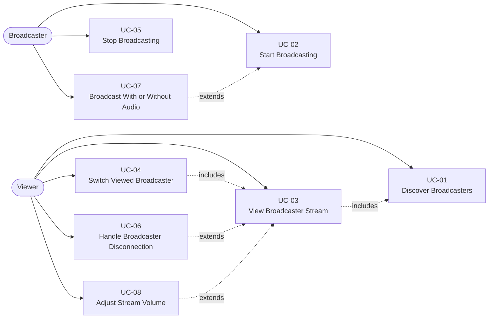
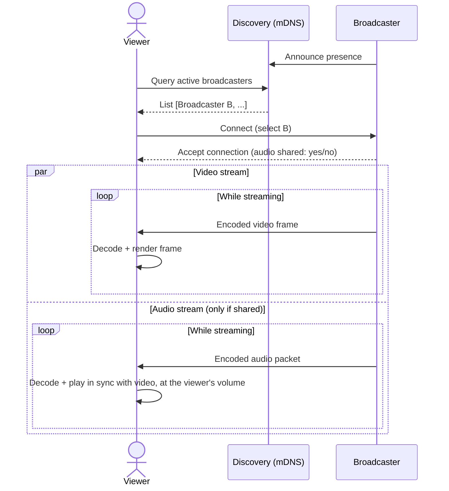
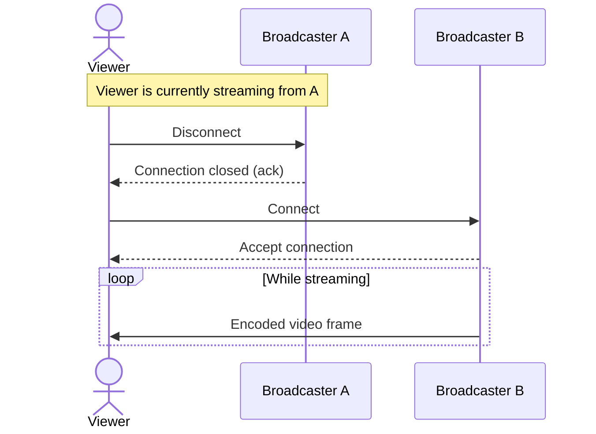
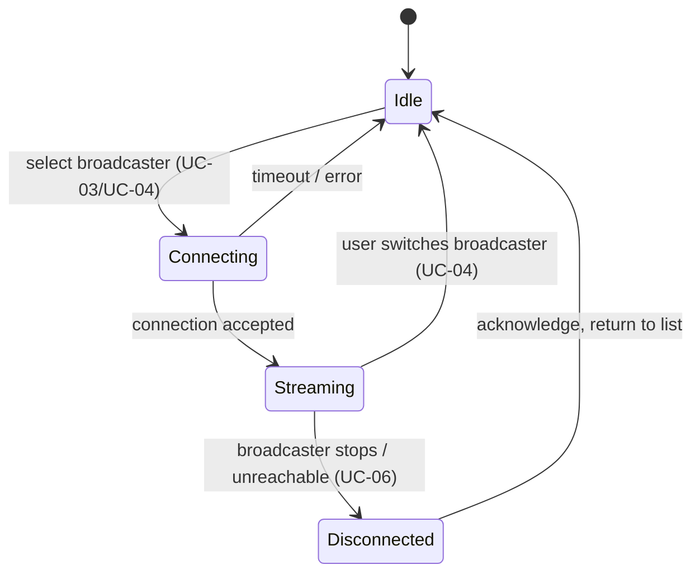
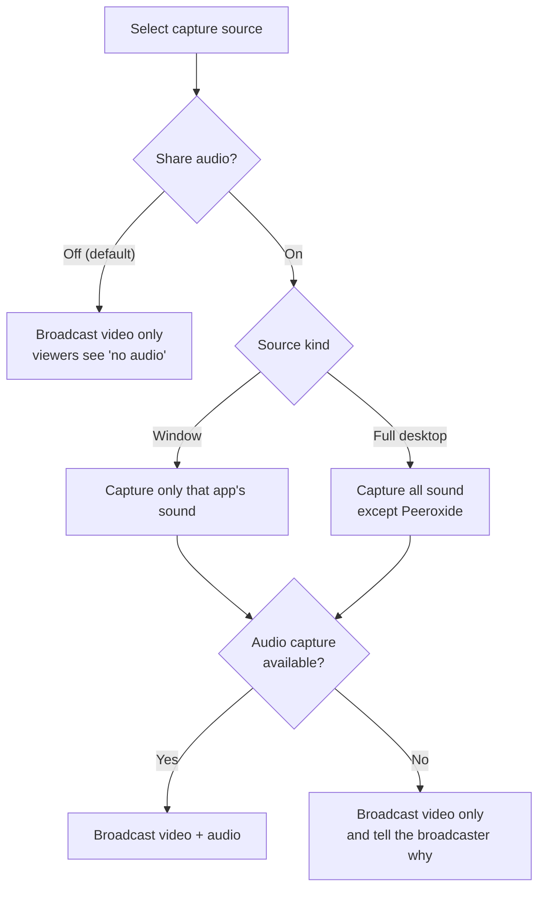

# Use Cases

Actors:

- **Broadcaster** — a user sharing their screen.
- **Viewer** — a user watching another peer's screen.
- **Discovery Service** — the mDNS-based mechanism peers use to find each other on the LAN (not a separate server; it runs as part of every peer).

Any peer can act as a Broadcaster, a Viewer, or both at the same time.

## Overview

## UC-01 — Discover Broadcasters

- **Actor:** Viewer
- **Preconditions:** The viewer's app is running and connected to the LAN.
- **Main flow:**
  1. The viewer's app listens for mDNS announcements from other peers.
  2. Each active broadcaster on the network periodically announces its presence (name, address, port).
  3. The viewer's app maintains and displays a live list of currently active broadcasters.
- **Postconditions:** The viewer sees an up-to-date list of broadcasters available to watch.
- **Exceptions:** If no broadcasters are active, the list is empty and the UI communicates this clearly.

## UC-02 — Start Broadcasting

- **Actor:** Broadcaster
- **Preconditions:** The user has granted the OS-level screen-recording permission if required by the platform.
- **Main flow:**
  1. The user selects a capture source (full desktop or a specific window).
  2. The user chooses whether to share audio (UC-07); audio is off unless they turn it on.
  3. The user starts the broadcast.
  4. The app begins capturing, encoding, and announcing itself via mDNS.
  5. The app starts accepting incoming viewer connections.
- **Postconditions:** The peer is listed as an active broadcaster and can serve viewers.
- **Exceptions:** If screen-recording permission is denied, the app shows an error and does not start broadcasting.

## UC-03 — View Broadcaster Stream

- **Actor:** Viewer
- **Preconditions:** UC-01 has produced at least one available broadcaster; the viewer has no other active viewing session.
- **Main flow:**
  1. The viewer selects a broadcaster from the list.
  2. The app opens a direct P2P connection to that broadcaster.
  3. The broadcaster tells the viewer whether this broadcast includes audio, then starts streaming encoded video (and audio, if shared) to this viewer.
  4. The viewer's app decodes and renders frames as they arrive, and plays the audio in sync with the video at the viewer's chosen volume (UC-08).
  5. The UI shows a "Streaming" status, and whether the broadcaster is sharing audio.
- **Postconditions:** The viewer is watching (and, if shared, hearing) exactly one broadcaster's screen.
- **Exceptions:**
  - If the connection cannot be established (timeout, broadcaster gone), the UI shows an error and returns to the broadcaster list.
  - If the viewer has no usable audio output device, or the audio can't be decoded, the video keeps playing and the UI says audio is unavailable.

## UC-04 — Switch Viewed Broadcaster

- **Actor:** Viewer
- **Preconditions:** The viewer currently has an active viewing session (UC-03) with Broadcaster A.
- **Main flow:**
  1. The viewer selects a different broadcaster, B, from the list.
  2. The app closes the connection to Broadcaster A.
  3. The app opens a new connection to Broadcaster B (UC-03 main flow, steps 2-5).
- **Postconditions:** The viewer now watches Broadcaster B exclusively; Broadcaster A no longer sends frames to this viewer.
- **Business rule:** A viewer never holds more than one active viewing connection (enforces FR-06).

## UC-05 — Stop Broadcasting

- **Actor:** Broadcaster
- **Preconditions:** The broadcaster has an active broadcast (UC-02).
- **Main flow:**
  1. The user stops the broadcast.
  2. The app stops capture/encoding and withdraws its mDNS announcement.
  3. The app closes all active viewer connections, sending a termination notice to each.
- **Postconditions:** The peer no longer appears in any viewer's broadcaster list; all its former viewers are notified (triggers UC-06 for each viewer).

## UC-06 — Handle Broadcaster Disconnection

- **Actor:** Viewer (system-triggered)
- **Preconditions:** The viewer has an active viewing session with a broadcaster that stops or becomes unreachable (UC-05, crash, or network loss).
- **Main flow:**
  1. The viewer's app detects the disconnection (explicit termination notice, or a stream/heartbeat timeout).
  2. The app tears down the local decode/render pipeline.
  3. The UI shows a "Disconnected" status and returns the viewer to the broadcaster list (UC-01).
- **Postconditions:** The viewer is not left in a stuck or ambiguous state after losing a stream.

### Viewer connection state (applies to UC-03, UC-04, UC-06)

## UC-07 — Broadcast With or Without Audio

- **Actor:** Broadcaster
- **Preconditions:** The broadcaster is about to start a broadcast (UC-02) and has selected a capture source.
- **Main flow:**
  1. The broadcaster turns "Share audio" on. It is off by default; the choice is remembered for the next broadcast.
  2. The app states exactly what will be captured for the selected source:
     - a **window**: only the sound of that window's application (and its child processes);
     - a **full desktop**: all sound playing on the computer, except Peeroxide's own playback;
     - the microphone is **never** captured.
  3. The broadcaster starts the broadcast (UC-02).
  4. When the first viewer connects, the app starts capturing and encoding audio alongside the video. Like video, audio capture pauses whenever nobody is watching.
- **Alternate flow — broadcast without audio:** The broadcaster leaves "Share audio" off. Only video is sent, and viewers are told the broadcaster isn't sharing audio.
- **Postconditions:** Every viewer of this broadcast receives the audio of the selected source, or none if audio is off.
- **Exceptions:** If audio capture is unavailable (unsupported OS version, no audio service), the broadcast starts video-only and the app tells the broadcaster why. An audio failure during the broadcast never stops the video.
- **Business rule:** The audio choice is fixed for the whole broadcast. To change it, the broadcaster stops (UC-05) and starts again.

## UC-08 — Adjust Stream Volume

- **Actor:** Viewer
- **Preconditions:** The viewer is watching a broadcaster (UC-03).
- **Main flow:**
  1. The viewer moves the volume slider (0–100%) or toggles mute.
  2. The change applies immediately to what this viewer hears.
  3. The volume and mute state are remembered across sessions and broadcasters.
- **Postconditions:** The stream plays at the chosen volume. Nothing changes for the broadcaster or for other viewers.
- **Exceptions:**
  - If the broadcaster isn't sharing audio (UC-07 alternate flow), the volume controls are replaced by a "The broadcaster isn't sharing audio" note.
  - If the viewer has no audio output device, the UI says so; the video keeps playing.
